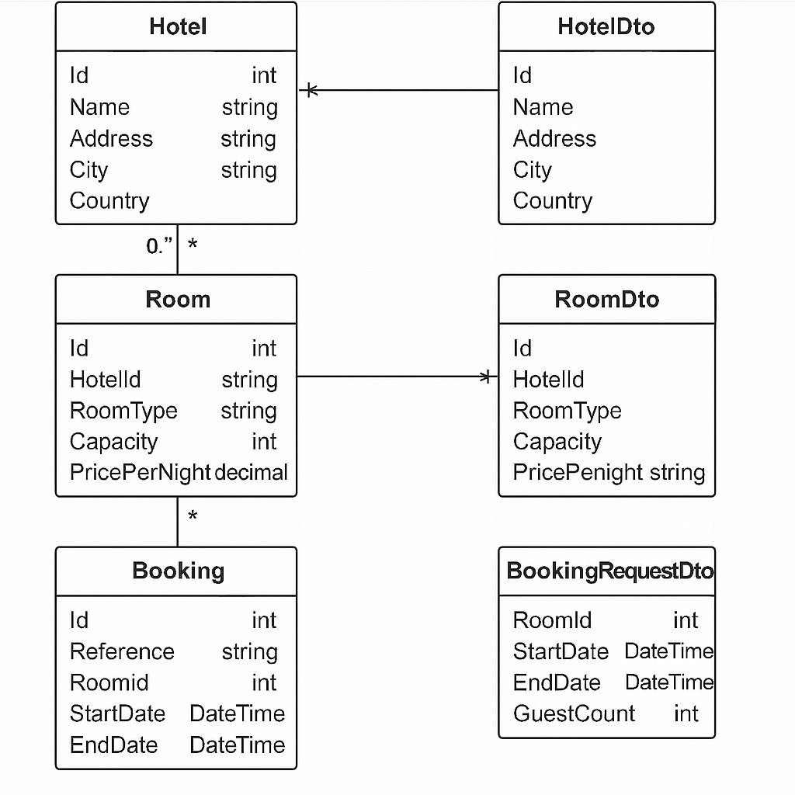

# 🏨 Hotel Room Booking API

A robust and scalable ASP.NET Core Web API for managing hotel room bookings. Built with Entity Framework Core and designed for professional-grade deployment.

---

## 📐 System Design Overview

This API follows a layered architecture:

- **Presentation Layer**: ASP.NET Core Controllers
- **Business Logic Layer**: Services and Validation
- **Data Access Layer**: EF Core Repositories
- **Database**: SQL Server Lite

---

## 🧩 Design Diagram



> This diagram illustrates the relationships between `Customer`, `Booking`, and `Room` entities.
> 

> This has the ERD and the Architectural Design

---


### 📚 API Endpoints
Admin Endpoints
- **POST** `/api/Admin/seeds`  
Populate database with just enough data for testing.  
- **POST** `/api/Admin/reset`  
 Remove all data ready for seeding.

---

Booking Endpoints
- **POST** `/api/Booking`  
  Makes a booking. Its takes Room ID, StartDate, EndDate, GuestCount
- **GET** `/api/bookings/{ref}`  
  Get details of a specific booking by reference.
  

---

Hotel Endpoints
- **GET** `/api/Hotel/{name}`  
  Get details of a specific Hotel by name.
- **GET** `/api/Hotel`  
  Get details of all Hotels in the database.
- **POST** `/api/Hotel`  
  Creates a Hotel
- **DELETE** `/api/Hotel/{id}`  
  Delete a hotel

---
	
Room Endpoints

- **GET** `/api/Rooms/available`  
  Retrieve a list of available rooms available for a certain time period and can take a given number of guests.

- **DELETE** `/api/Rooms/{id}`  
  Delete a room 

- **GET** `/api/Rooms/hotel/{hotelid}`  
  Get details of rooms in a specific hotel.

- **POST** `/api/Rooms`  
  Add a new room 


## 🚀 Getting Started

### 🔧 Prerequisites

- [.NET 8 SDK](https://dotnet.microsoft.com/en-us/download)
- SQL Server Lite 
- Visual Studio or VS Code

### 📦 Installation

```bash
git clone https://github.com/yourusername/HotelBookingAPI.git
cd HotelBookingAPI
dotnet restore


